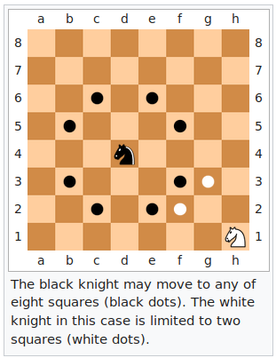

Knight's path
=============

Implement a program that finds the shortest path a knight can take between two points on a standard 8x8 chessboard.

In chess, knights move in an L-shape: 2 squares along one dimension, 1 square along the other. See the [Wikipedia illustration](https://en.wikipedia.org/wiki/Knight_(chess)#Placement_and_movement):



Functional Requirements
-----------------------

  - Write a command-line executable that reads instructions from standard input (stdin).
  - Instructions are lines (separated by newlines) in the following format:
```
D4 G7
D4 D5
```

  - The first of the space-separated values is the knight's starting position, the second is the knight's target position.
  - For each line in the input, your program should print (to standard out) the shortest path it found. So for the example above, it should print e.g.:
```
D4 F5 G7
D4 E2 F4 D5
```

Notes
-----

  - Use language you are most comfortable in.
  - Apply development practices you use to write **production code**.
  - Feel free to use supporting libraries (but write the algorithm yourself).
  - Provide complete instructions for running your code and installing dependencies.
  - Document assumptions and decisions in readme file.
  - It should be possible to run your program on Linux or macOS.
  - Please provide us with access to git repo with code when you’re done.
